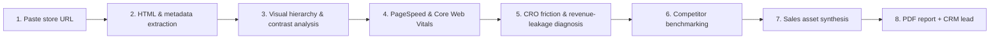

# 🧠 Troopod Agency Engine — AI-Native E-Commerce Growth Platform

> Paste any store URL → get a full CRO audit, revenue forecast, multi-channel sales assets, and an executive PDF report — autonomously.

**Troopod Agency Engine** is an end-to-end agentic SaaS demo for agencies and e-commerce growth teams. Given a single input — any store URL like `https://allbirds.com` or `https://gymshark.com` — it executes an autonomous growth sprint and turns website data into pitch-ready deliverables:

- 🔍 **Automated CRO teardown** — friction points, revenue leakage, competitor benchmarking
- 📈 **Revenue opportunity model** — traffic, AOV, and conversion-lift → ARR projection
- ✍️ **Sales asset synthesis** — cold email, LinkedIn InMail, Twitter DM, founder intro
- 📄 **Executive PDF reports** — client-ready, multi-page, downloadable
- 🧲 **CRM pipeline** — audit auto-creates a qualified lead, trackable to Closed Won

**Stack:** FastAPI + Pydantic v2 backend · Next.js 15 (App Router) + React 19 frontend · Docker-ready · Supabase Postgres schema included.

---

## 🚀 The Pipeline



Every AI analysis output is validated against **strict Pydantic v2 schemas** — guaranteed predictable, structured JSON end to end.

---

## ✨ Features

| Module | What it does |
|---|---|
| **Quick Scanner** | One URL → full multi-stage audit with live progress |
| **Audit Teardown** | Growth/conversion/trust/UX/readability scores, friction points with severity + recommended fixes, PageSpeed & Web Vitals breakdown |
| **Revenue Calculator** | Real-time sliders (traffic, AOV, conversion lift) with live annual ARR projection |
| **Heatmap Visualizer** | Interactive wireframe layers — click density, attention heatmaps, scroll dropoff |
| **Outreach Hub** | Auto-generated, editable cold emails, LinkedIn InMails, Twitter DMs, follow-ups, founder scripts, proposals |
| **CRM Pipeline** | Lead stages (New → Contacted → Demo → Proposal → Closed Won), owners, follow-up dates, CSV export |
| **Rewrite Lab** | AI landing-page headline variations, CTA improvements, pricing suggestions, FAQ, SEO meta |
| **PDF Hub** | One-click executive report downloads per audit |
| **⌘K Search** | Instant global search across audits and leads |

---

## 🗂️ Architecture

```
frontend/            Next.js 15 + React 19 + Tailwind dashboard
  src/components/      dashboard · audit · crm · outreach · rewrites · settings
  src/lib/api.ts       typed API client

backend/             FastAPI + Pydantic v2 (clean architecture)
  app/routers/         audits · crm · outreach · rewrites · reports · export · health
  app/services/        scraper · vision · pagespeed · ai_analyzer · competitor · outreach · pdf
  app/schemas/         strict structured-output models (Pydantic v2)
  app/db/store.py      persistent JSON store (Supabase Postgres schema included)

supabase/schema.sql  production-ready PostgreSQL schema (audits, crm_leads, outreach_campaigns)
```

### API surface (prefix `/api/v1`)

| Endpoint | Purpose |
|---|---|
| `POST /audits/scan` | Run the full audit pipeline on a URL |
| `GET /audits` · `GET /audits/{id}` · `DELETE /audits/{id}` | List / retrieve / delete audits |
| `GET/POST /crm` · `PATCH/DELETE /crm/{lead_id}` | CRM lead pipeline |
| `POST /outreach/generate` | Generate multi-channel outreach campaign for an audit |
| `POST /rewrites/landing-page?audit_id=` | Landing-page rewrite variations |
| `GET /reports/pdf/{audit_id}` | Download executive PDF report |
| `GET /export/csv` | Export audits to CSV |
| `GET /health` | Service health check |

---

## 🛠️ Quickstart

### Backend (FastAPI)

```bash
cd backend
python3 -m venv venv
source venv/bin/activate
pip install -r requirements.txt
uvicorn app.main:app --reload --port 8000
```

Interactive API docs → `http://localhost:8000/docs`

### Frontend (Next.js 15)

```bash
cd frontend
npm install --legacy-peer-deps
npm run dev
```

Dashboard → `http://localhost:3000`

### Docker

```bash
docker-compose up --build
```

---

## 🚢 Deployment

- **Frontend:** Deploy `./frontend` to Vercel
- **Backend:** Deploy `./backend` with `uvicorn app.main:app` (Railway / Render)
- **Database:** Run `supabase/schema.sql` on Supabase PostgreSQL

---

## 🧪 Tests

```bash
cd backend && python -m pytest tests/ -v
```

---

## 📄 License

MIT © Darsh Iyer
